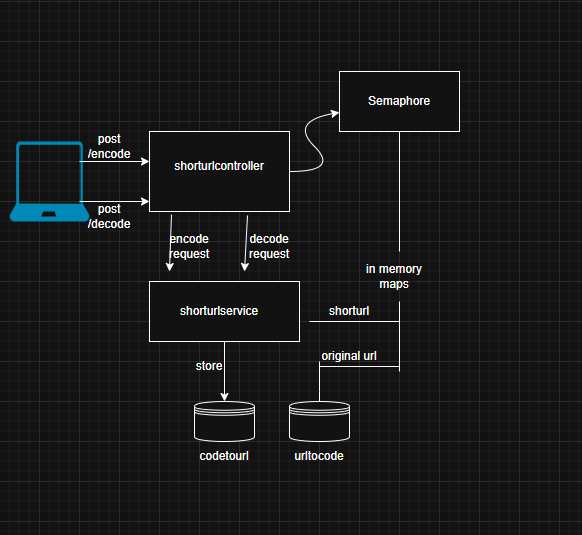

# ShortURL - URL Shortener Service

## How to Run

### Prerequisites
- Java 22
- Maven
- VS Code or preferred IDE

### Build and Start
```bash
mvn clean install
mvn spring-boot:run -Dspring-boot.run.arguments="--shorturl.concurrent.limit=10"

### Architecture Diagram
The diagram below illustrates how the ShortLink service handles requests with concurrency control:



1. The client sends a POST request to either `/encode` or `/decode`.
2. The `ShortLinkController` checks if the request can proceed using a `Semaphore`.
3. If allowed, the request is passed to `ShortLinkService`, which:
   - Uses `ConcurrentHashMap` to store or retrieve URLs.
   - Handles encode/decode operations in-memory for fast access.

### Test Endpoints

#### Encode
```powershell
Invoke-WebRequest -Uri "http://localhost:8080/encode" `
    -Method Post `
    -Headers @{ "Content-Type"="application/json" } `
    -Body '{ "url": "http://big.timothy" }'

#### Decode
```powershell
Invoke-WebRequest -Uri "http://localhost:8080/decode" `
    -Method Post `
    -Headers @{ "Content-Type"="application/json" } `
    -Body '{ "shortUrl": "http://lil.tim/RandomUUID" }'
